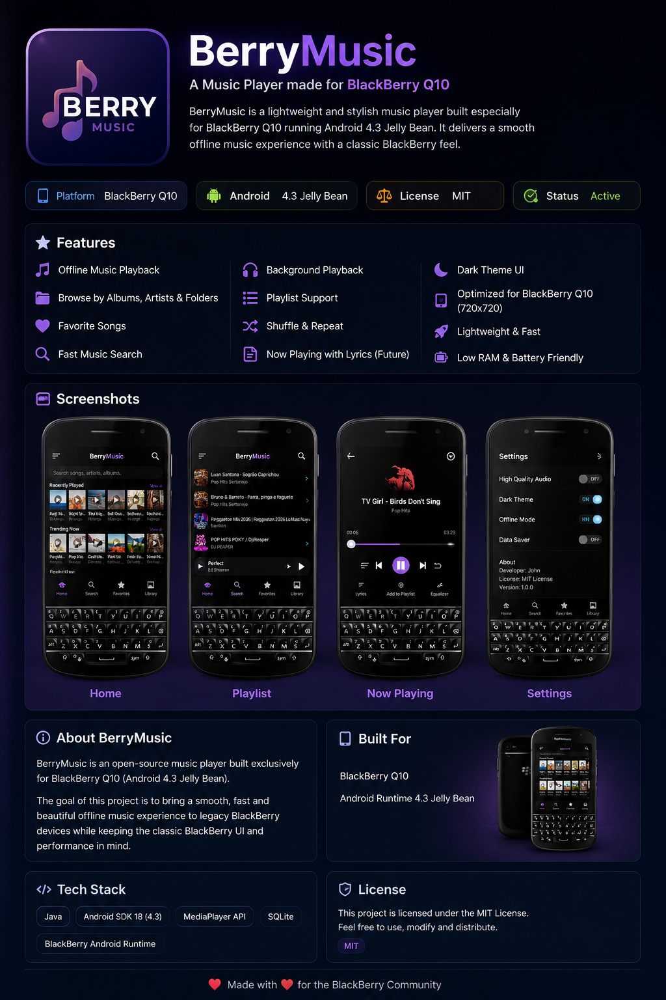
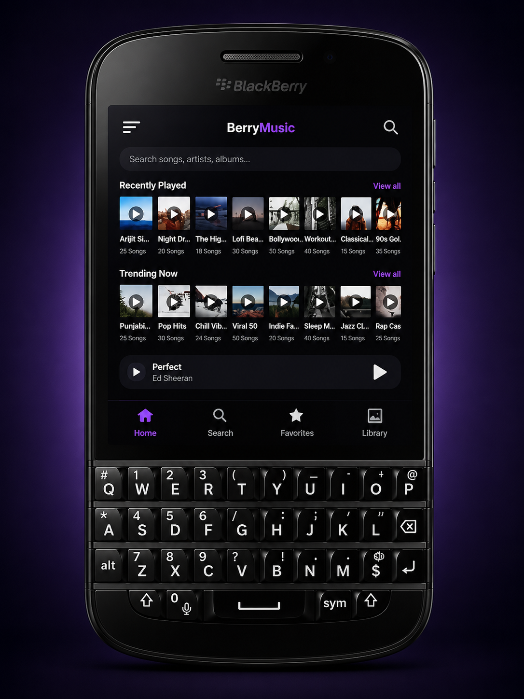
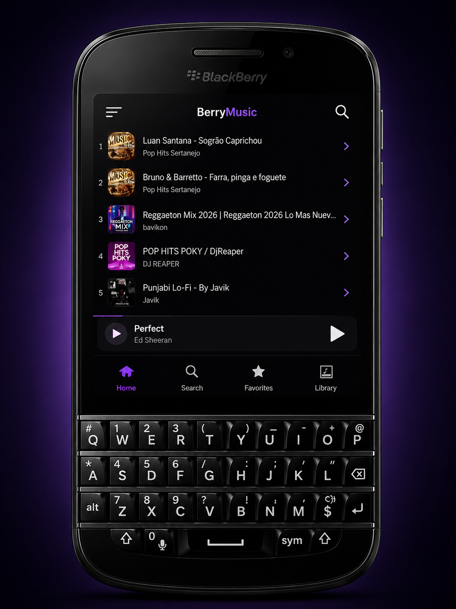
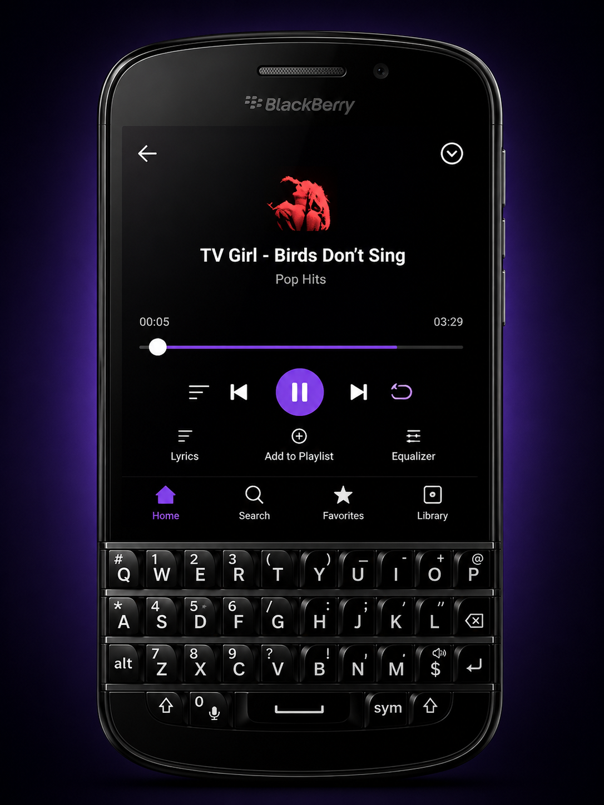
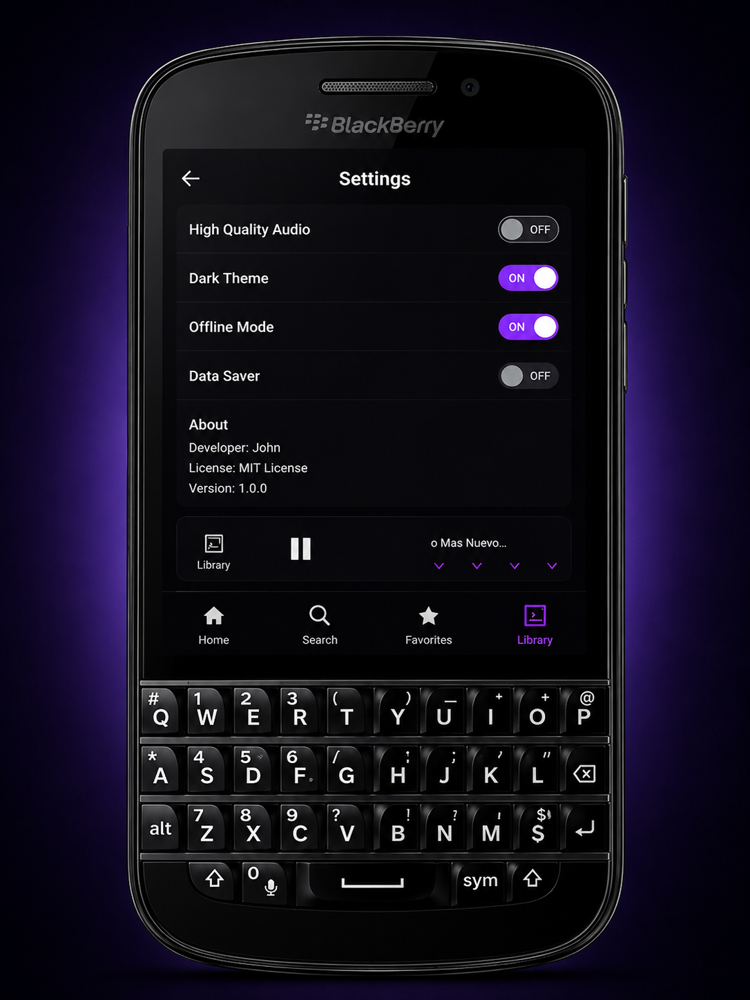

# 🍇 BerryMusic

### Modern Music Player for BlackBerry Q10

A lightweight, fast and beautiful offline music player built exclusively for BlackBerry 10 devices running the Android 4.3 Jelly Bean Runtime.

---

# 🎵 About

BerryMusic is an open source music player designed especially for **BlackBerry Q10** and other **BlackBerry 10** smartphones running the **Android 4.3 Jelly Bean Runtime**.

The project was created to bring a modern music experience to legacy BlackBerry devices while maintaining excellent performance, low memory usage and a clean BlackBerry-inspired interface.

Unlike most modern music players, BerryMusic is optimized specifically for older hardware, making it smooth, lightweight and reliable on BlackBerry devices.

---

# ✨ Features

- 🎵 Offline Music Playback
- 🎧 Background Playback
- 🔍 Fast Song Search
- ❤️ Favorites
- 📚 Music Library
- 📂 Browse Albums & Artists
- 📃 Playlist Support
- 🎚 Built-in Audio Equalizer
- 🎤 Lyrics Support
- ▶ Mini Player
- ⏩ Shuffle & Repeat
- 🌙 Dark Theme
- 💾 Offline Mode
- 📉 Data Saver
- ⚡ Lightweight Performance
- 🔋 Battery Friendly
- 📱 Optimized for BlackBerry Q10 (720×720)
- 🎨 Beautiful BlackBerry Inspired UI

---

# 📸 Screenshots

| Home | Search |
|------|--------|
|  |  |

| Now Playing | Settings |
|-------------|----------|
|  |  |

---

# 🚀 Why BerryMusic?

BerryMusic was built because modern music applications no longer support Android 4.3 and BlackBerry Runtime.

This project focuses on providing:

- Beautiful User Interface
- Fast Music Playback
- Low RAM Usage
- Smooth Performance
- Legacy Device Support
- BlackBerry Optimized Experience

---

# 📱 Supported Devices

- BlackBerry Q10
- BlackBerry Q5
- BlackBerry Z10
- BlackBerry Classic
- BlackBerry Passport (Android Runtime)
- Android 4.3 Jelly Bean Runtime

---

# 🛠 Tech Stack

- Java
- Android SDK 18
- Android Studio
- MediaPlayer API
- SQLite
- Material Components

---

# 📂 App Sections

- 🏠 Home
- 🔍 Search
- ❤️ Favorites
- 📚 Library
- 🎵 Now Playing
- ⚙ Settings

---

# 🎯 Vision

BerryMusic is more than just a music player.

The goal of this project is to keep BlackBerry smartphones alive by creating modern applications that continue to work perfectly on the Android Runtime.

BerryMusic combines classic BlackBerry design with modern music playback features while remaining lightweight and easy to use.

---

# 📌 Roadmap

- [ ] Sleep Timer
- [ ] More Themes
- [ ] Better Playlist Manager
- [ ] Album Art Downloader
- [ ] Performance Improvements
- [ ] More Audio Effects
- [ ] UI Enhancements

---

# ❤️ Contributing

Contributions, ideas, bug reports and feature requests are always welcome.

If you like this project, don't forget to ⭐ the repository.

---

# 📄 License

This project is licensed under the **MIT License**.

---

## 🍇 BerryMusic

### Made with ❤️ for the BlackBerry Community

